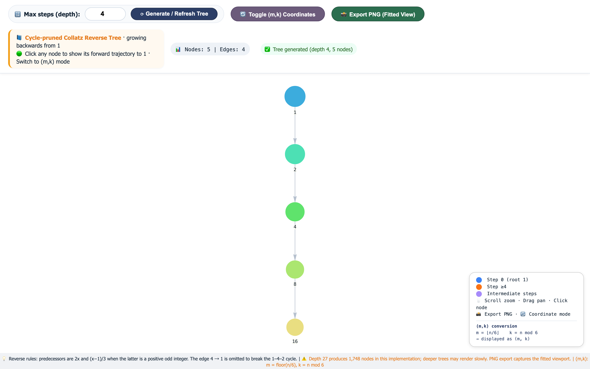

**目次：**

- [中国語](README.md)
- [英語](README.en.md)
- [日本語](README.ja.md)

# Collatz 逆木インタラクティブビジュアライザー



`1` を根とする**閉路を取り除いた逆 Collatz 木**（cycle-pruned reverse Collatz tree）のための、インタラクティブなブラウザビジュアライザーです。深さの調整、生の数値と `(m,k)` のラベル、順方向の軌跡の確認、フィットしたビューポートの PNG エクスポートに対応しています。

> **訂正：** この README の以前のバージョンは、根が `5` と `32` である逆方向の部分木が同型であると誤って主張し、下記の漸化式が 21 ステップのサイクルを持つと記述し、奇数の先行ノードに対する誤った `(m,k)` 公式を示していました。これらの主張はここで訂正されており、自動化されたテストでカバーされています。

## 目次

- [このプロジェクトについて](#このプロジェクトについて)
  - [機能](#機能)
- [ビジュアライザーが利用する数学的事実](#ビジュアライザーが利用する数学的事実)
  - [奇数の先行ノードと分岐条件](#奇数の先行ノードと分岐条件)
  - [3 の倍数](#3-の倍数)
  - [正しい `(m,k)` の逆方向ルール](#正しい-mk-の逆方向ルール)
- [訂正：根が 5 と 32 の部分木は同型ではない](#訂正根が-5-と-32-の部分木は同型ではない)
- [訂正：最大素因数漸化式と 233 サイクル](#訂正最大素因数漸化式と-233-サイクル)
- [使い方](#使い方)
- [自動検証](#自動検証)
- [リポジトリ構成](#リポジトリ構成)
- [制限事項](#制限事項)
- [参考文献](#参考文献)
- [研究誠実性に関する注記](#研究誠実性に関する注記)
- [関連記事](#関連記事)

## このプロジェクトについて

`Collatz reverse tree.html` は、次に示す通常の（加速していない）Collatz 写像を用いて、`1` から幅優先の逆木を構築します。

\[
C(x)=
\begin{cases}
3x+1, & x\text{ odd},\\
x/2, & x\text{ even}.
\end{cases}
\]

現在の値 `n` に対して、可能な逆方向の先行ノードは次のとおりです。

1. `2n`（常に有効）。
2. `(n-1)/3`（正の奇数である場合）。

ビジュアライザーは、`4` から `1` への逆方向の辺を意図的に省略しています。この例外がなければ、逆方向の構造にはおなじみのサイクル `1 → 4 → 2 → 1` が含まれ、根付き木ではなくなります。そのため、このページが表示するのは**閉路を取り除いた根付き木**であり、完全な逆方向有向グラフではありません。

### 機能

- 選択した深さまで、閉路を取り除いた逆木を生成します。
- `n` と `(m,k)` のラベルを切り替えます。ここで
  \[
  m=\lfloor n/6\rfloor,\qquad k=n\bmod 6.
  \]
- ノードをクリックすると、`1` に戻る実際の順方向 Collatz 軌跡が表示されます。
- その軌跡内のノードと辺をハイライト表示します。
- グラフを現在のキャンバスのビューポートにフィットさせてからエクスポートします。

## ビジュアライザーが利用する数学的事実

### 奇数の先行ノードと分岐条件

奇数の逆方向の先行ノードが存在するのは、ある非負の整数 `q` について

\[
\frac{n-1}{3}=2q+1
\]

が成り立つとき、そのときに限ります。変形すると

\[
n=6q+4,
\]

となるため、完全な逆方向グラフでは

\[
n\text{ has an odd predecessor}\iff n\equiv4\pmod 6.
\]

すべての正の整数は、偶数の先行ノード `2n` も持ちます。したがって、ノードが 2 つの逆方向の先行ノードを持つのは、`n ≡ 4 (mod 6)` のときかつそのときに限ります。

表示に特有の例外が 1 つあります。`n=4` のとき、奇数の先行ノードは `1` であり、根のサイクルを断ち切るためにその辺は省略されます。したがって、この閉路を取り除いた木では、ノード `4` に表示される子は 1 つしかありません。

### 3 の倍数

`n=3q` の場合、

\[
\frac{n-1}{3}=q-\frac13
\]

は整数ではありません。したがって、`3` の倍数には奇数の逆方向の先行ノードが存在しません。

### 正しい `(m,k)` の逆方向ルール

次のように書きます。

\[
n=6m+k,\qquad 0\le k<6.
\]

常に有効な偶数の先行ノードについては、

\[
2n=12m+2k,
\]

となり、その座標は次のとおりです。

\[
\left(2m+\left\lfloor\frac{k}{3}\right\rfloor,\;2k\bmod6\right).
\]

奇数の先行ノードは `k=4` の場合にのみ存在します。その場合、

\[
\frac{n-1}{3}=2m+1.
\]

その `(m,k)` 座標は、得られた整数から計算する必要があります。

\[
\left(
\left\lfloor\frac{2m+1}{6}\right\rfloor,
(2m+1)\bmod6
\right).
\]

等価的に、`m=3q+r`（`r∈{0,1,2}`）と表せる場合、奇数の先行ノードの座標は次のとおりです。

\[
(q,2r+1).
\]

たとえば、`16=6·2+4` の奇数の先行ノードは `5` であり、その座標は `(0,5)` です。

## 訂正：根が 5 と 32 の部分木は同型ではない

以前の README は、有限の深さにおける視覚的な類似性から、無限の構造的同型性を推論していました。その推論は誤りでした。

同じ逆方向の分岐語 `EEEOEEOEO` を適用します。ここで `E(x)=2x`、`O(x)=(x-1)/3`（有効な場合）です。

```text
5  → 10 → 20 → 40 → 13 → 26 → 52  → 17  → 34  → 11
32 → 64 → 128 → 256 → 85 → 170 → 340 → 113 → 226 → 75
```

対応する値 `11` と `75` は法 `6` について合同ではありません。

```text
11 ≡ 5 (mod 6)
75 ≡ 3 (mod 6)
```

偶数の逆方向ステップをもう 1 つ進めると、`22` と `150` になります。

```text
22  ≡ 4 (mod 6)  → 奇数の先行ノードがあり、分岐する
150 ≡ 0 (mod 6)  → 奇数の先行ノードがない
```

したがって、2 つの根付き逆木のレベル数が初めて異なるのは、深さ 11 です。

| 部分木の根からの深さ | `T5` のノード数 | `T32` のノード数 |
|---:|---:|---:|
| 9 | 9 | 9 |
| 10 | 12 | 12 |
| 11 | 15 | 14 |
| 12 | 19 | 17 |

この反例は、以前の同型性の主張を反証します。また、有限の視覚的な一致と法 6 に関する観察だけでは、無限の木の同型性を確立するには不十分であることも示しています。

## 訂正：最大素因数漸化式と 233 サイクル

関連する調査では、次の漸化式が検討されました。

\[
F(n)=10\operatorname{LPF}(n)+(\operatorname{LPF}(n)\bmod10),
\]

ここで `LPF(n)` は `n` の最大素因数です。

この正確な定義の下では、`233` から始まる軌道は **26 状態のサイクル** であり、21 ステップのサイクルではありません。

```text
233 → 2333 → 23333 → 233333 → 6611 → 6011 → 60111
→ 66799 → 9977 → 9077 → 3133 → 2411 → 24111 → 477
→ 533 → 411 → 1377 → 177 → 599 → 5999 → 8577 → 9533
→ 95333 → 136199 → 194577 → 8211 → 233
```

特に、`9533` は素数であるため、

\[
F(9533)=10·9533+3=95333,
\]

となり、`233` ではありません。

このリポジトリは上記のサイクルを検証しますが、**すべての開始整数がこのサイクルに入ると主張・証明するものではありません**。`10^9` までの実験や経路確率に関する、根拠のない以前の記述は、対応するデータと再現可能な解析がリポジトリに存在しなかったため削除されました。

## 使い方

1. リポジトリをダウンロードまたはクローンします。
2. インターネットにアクセスできる最新のブラウザで `Collatz reverse tree.html` を開きます。このページは現在、バージョン固定の CDN から `vis-network` を読み込みます。
3. 深さを入力し、**Generate / Refresh Tree** をクリックします。
4. 必要に応じて `(m,k)` ラベルを切り替えます。
5. ノードをクリックして、`1` に至る順方向の軌跡を確認し、ハイライトします。
6. **Export PNG (Fitted View)** をクリックして、現在キャンバスにフィットしているグラフを保存します。

深さの入力は `30` に制限されています。現在の、閉路を取り除くジェネレーターでは、深さ `8` で `17` ノード、深さ `12` で `47` ノード、深さ `27` で `1,748` ノードになります。

## 自動検証

数学のコアは `collatz-math.js` にあり、ブラウザページと Node.js テストで共有されています。

実行：

```bash
node --test tests/collatz-math.test.js
```

テストは以下を確認します。

- 生成されたすべての逆方向の辺が、順方向の Collatz 規則の下で元に戻ること。
- 根のサイクルを取り除く特別な規約。
- `(m,k)` の往復と、訂正された奇数の先行ノードの例。
- 選択した深さでの既知のノード数。
- `T5 ≅ T32` に対する明示的な反例。
- 記載された最大素因数漸化式の下での完全な 26 状態サイクル。

## リポジトリ構成

```text
├── Collatz reverse tree.html   # インタラクティブビジュアライザー
├── collatz-math.js             # 共有される数学コア
├── tests/
│   └── collatz-math.test.js    # 自動化された数学的検証
└── README.md
```

## 制限事項

- Collatz 予想は依然として証明されていません。このビジュアライザーは証明ではありません。
- ビジュアライザーが表示するのは、有限の閉路を取り除いた木であり、見た目だけから無限の部分木の同値性に関する主張を正当化することはできません。
- JavaScript の `Number` 演算は `2^53-1` までの整数に対してのみ正確です。UI の深さの上限により、現在の根 1 の木はこの範囲内に収まっていますが、将来の拡張では明示的な安全な整数チェックを維持すべきです。
- PNG エクスポートはフィットしたキャンバスのビューポートをキャプチャします。任意にスケール可能な全グラフレンダラーではありません。
- `vis-network` はインターネットから読み込まれるため、このページはまだ完全にはオフラインで動作しません。

## 参考文献

- Lagarias, J. C. (1985). *The 3x + 1 problem and its generalizations*. American Mathematical Monthly, 92(1), 3–23.
- Andrei, S., & Kudlek, M. *Some results on the Collatz problem*.

## 研究誠実性に関する注記

これらの訂正の目的は、証明された事実、計算による観察、反証された予想、未解決の問題を区別することです。以前の予想に対する反例を見つけることは、数学的プロセスの一部であり、計算によって反証された主張を保持し続けるよりも有益です。

## 関連記事

その他のプロジェクト、解説記事、実験は、私の個人サイト [keng0nion.github.io](https://keng0nion.github.io/) にあります。
